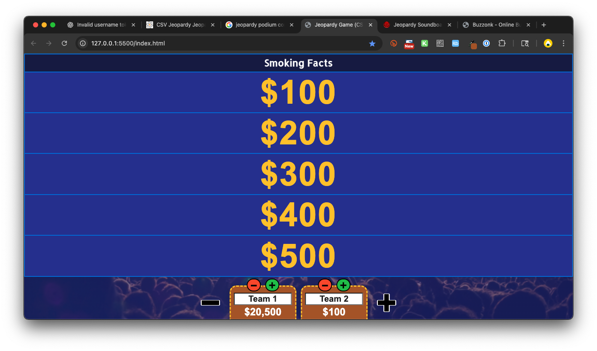

# Summary

Fast and simple Jeopardy-style classroom game show. Made by [@domlet](https://domlet.github.io/) for classroom teachers. Just drag a CSV file onto the [game screen](indexhtml) to start play. Nothing fancy. Use a computer (not a phone) to host the game.

**Does not include:** Double Jeopardy, Daily Double, Final Jeopardy, or timing controls.

Scorekeeping is manual; to give `$300` to **Team 5**, the host must click the `+` button on **Team 5** three times.

Host can change **font size** with `⌘+` and `⌘-` (Mac) or `Control+` and `Control-` (most other keyboards).

Questions or comments? Use the [comments form here](https://domlet.github.io/).

## Instructions

<video src="https://github.com/locaal-ai/obs-backgroundremoval/assets/1067855/5ba5aae2-7ea2-4c90-ad45-fba5ccde1a4e" width="400"></video>

### Play Game (Simple Mode)

- [Use this slide](https://docs.google.com/presentation/d/19xjwrqt-tvVk85XkU_7MRocQ3fE2uTknxe36J5nAPg8/edit?slide=id.g372bb133f6c_0_1418#slide=id.g372bb133f6c_0_1418) to explain game play in 60 seconds.
- Divide your group into 7 (or fewer) teams.
- [Load the game](https://domlet.github.io/jeopardy-csv) and drag a [CSV file](sample.csv) onto it.
- Click `+` or `-` to add or remove teams.
- **Optional:** Click and type to rename teams (`Team 1`, `Team 2`, `Team 3`...)
- Play the game! (15-45 min)

### Play Game (Enhanced Mode w/buzzers)

As host, you can use another device (ie, tablet or mobile device) to operate a buzzer system. This can help reduce facilitator bias. However, buzzer enthusiasm can lead to hardware damage, so I recommend using students' mobile phones as buzzers (not laptops or Chromebooks). Here are instructions:

- **Optional:** Create a [Buzzonk](https://buzzonk.com/) room to track who buzzes in first.
- **Optional:** Each team can customize their name on Buzzonk.
- **Optional:** Update team names on the host screen (`Team 1`, `Team 2`, `Team 3`...)
- **Optional:** Play the game!

If you are very extra, you might use [Jeopardy Soundboard](https://www.myinstants.com/en/search/?name=jeopardy) from Myinstants. 🙀

## Key Controls (for Host)

**Optional.** During game play, you can press these keys to trigger actions and sound effects:

| Key                | What it does           | Sound                                                                           |
| ------------------ | ---------------------- | ------------------------------------------------------------------------------- |
| `Space` / `Return` | Show answer.           | [crowd ooohs](sounds/264499__noah0189__crowd-ooohs-and-ahhhs-in-excitement.mp3) |
| `Escape`           | Close window.          | [click sound](sounds/273833__alienxxx__micro_clicks_001.wav)                    |
| `5`                | Gray out the question. | [timeout tone](sounds/timeout.mp3)                                              |

## How to Create a New Game?

1. Create a **CSV file** with 4 headings: `Category`, `Value`, `Clue` and `Answer` (see table below).
1. Want a template?
   1. [Download this CSV file](samples/jeopardy-template.csv), or
   1. [Copy this Google Sheet](https://docs.google.com/spreadsheets/d/1j9DGfF-acmh0VqTxSSx45rUhMezAvhnixP8vkoHiIzg/edit?gid=0#gid=0).
1. Want to see a completed example? Look at [`sample.csv`](sample.csv)
1. **Tip:** Don't leave [empty rows](samples/sample_empty_rows_input.png) in your spreadsheet. [Annoying result](samples/sample_empty_rows_output.png).

| Category      | Value | Clue                                                               | Answer     |
| ------------- | ----- | ------------------------------------------------------------------ | ---------- |
| Smoking Facts | 100   | Most commonly used drug in the U.S.                                | Nicotine   |
| Smoking Facts | 200   | Each cigarette a person smokes shortens their life by this amount. | 11 minutes |
| Smoking Facts | 300   | This percentage of U.S. adults use tobacco.                        | 30%        |

### How Many Questions?

You don't have to use a 5x5 board (25 questions), as shown in the sample game. See below, some examples with as few as 1x4 and 4x1 layouts:

| CSV file                                   | Input                                | Output                                |
| ------------------------------------------ | ------------------------------------ | ------------------------------------- |
| [`sample_4x4.csv`](samples/sample_4x4.csv) |  |  |
| [`sample_4x1.csv`](samples/sample_4x1.csv) |  |  |
| [`sample_1x4.csv`](samples/sample_1x4.csv) |  |  |

## Contributing

Anyone can fork and customize the game. Please make a ✨[PR](https://en.wikipedia.org/wiki/Distributed_version_control#Pull_requests)✨ if you add something ingenious. Help me test with [BrowserStack](https://www.browserstack.com/).

## Licensed

<a href="https://github.com/domlet/jeopardy-csv">Jeopardy-CSV</a> © 2025 by <a href="https://domlet.github.io/about">Dom Brassey (@domlet)</a> is licensed under <a href="https://creativecommons.org/licenses/by-nc/4.0/">CC BY-NC 4.0</a> 
